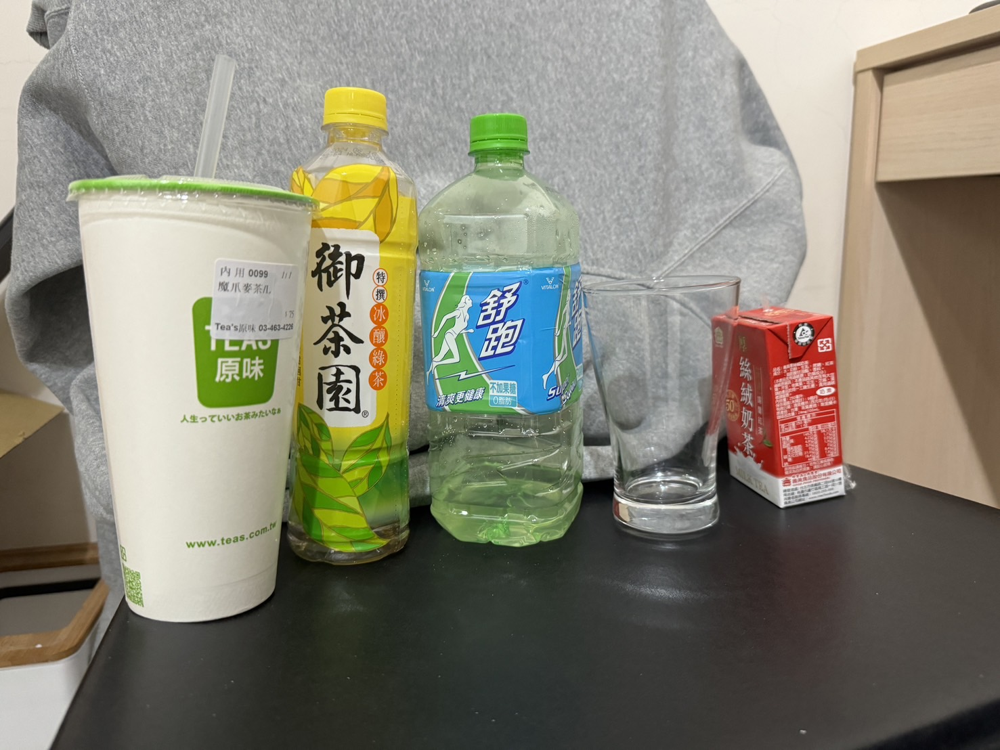
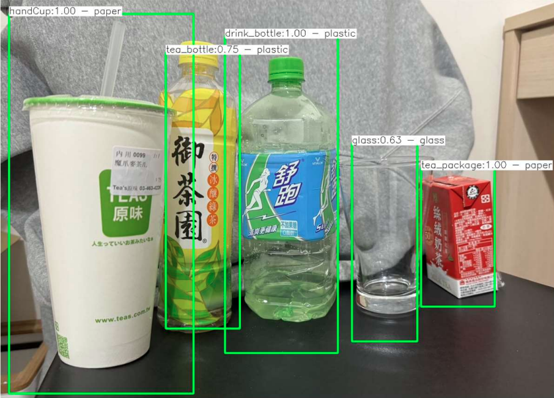

# Object Detection and Material Classification Using YOLO and GLCM

This project presents a hybrid computer vision pipeline that integrates deep learning-based object detection (YOLO) with traditional texture analysis (GLCM) to categorize detected objects by material type, such as metal, glass, plastic, and paper. The project was implemented entirely in C++ using OpenCV, and demonstrates a rule-based approach to combining statistical and learned features.

## Motivation

Accurate material classification is essential in applications such as waste sorting, recycling, and manufacturing inspection. While deep learning models like YOLO are effective at detecting objects and their locations, they may not reliably distinguish between materials that share similar shapes but differ in texture. This project addresses that gap by incorporating Gray-Level Co-occurrence Matrix (GLCM) features into the analysis pipeline, leveraging fine-grained texture patterns to support post-detection material classification.

## Method Overview

1. **Object Detection with YOLO**
   - A YOLOv4-tiny model is used to detect objects and generate bounding boxes from input images.
   - Custom-trained weights (`my_yolo_best.weights`) were used on a small-scale material dataset.

2. **Image Preprocessing**
   - Detected objects are cropped from the original image and converted to grayscale for texture analysis.

3. **GLCM Feature Extraction**
   - Four GLCM features are computed: contrast, homogeneity, energy, and correlation.
   - GLCMs are calculated using directional offsets such as (1, 0) and (0, 1) to capture texture variation.

4. **Material Classification (Heuristic Approach)**  
   - GLCM features (contrast, homogeneity, energy, correlation) are directly compared against manually defined threshold ranges.  
   - Each material type is classified using a set of hard-coded value intervals derived from visual inspection and trial runs.  
   - No supervised learning, clustering, or statistical modeling was involved.

## Technologies and Tools

- **Programming Language**: C++
- **Libraries**: OpenCV (image processing), YOLOv4-tiny (deep learning inference)
- **Model**: YOLOv4-tiny with custom configuration and weights

## Dataset and Model Weights

- The dataset consists of images manually labeled into four material categories.
- YOLO model weights are hosted externally due to GitHub file size restrictions.

[Download YOLOv4 Weights](https://drive.google.com/drive/folders/1ZmPFxEZ_VvaQVP2O_kExBN98cEGbEjKV?usp=sharing)

## Limitations

- The current material classification is purely rule-based and lacks adaptability across diverse datasets.
- No supervised classifier was trained to generalize the GLCM features for unseen samples.
- The dataset is relatively small and may not reflect real-world variations or edge cases.
- Thresholds and feature selection are manually defined and may not represent optimal decision boundaries.

## Potential Improvements

- Replace the rule-based decision logic with a supervised learning model trained on GLCM feature vectors (e.g., SVM, Random Forest).
- Expand the dataset with real-world samples from diverse material categories.
- Conduct hyperparameter tuning for GLCM computation (e.g., distance, angle, normalization).
- Explore fusion techniques combining deep learning embeddings and GLCM features for more robust classification.

## Application Scenarios

- Automated waste sorting systems
- Industrial inspection and material identification
- Lightweight, real-time material classification on embedded devices

## Demonstration

### Input Example
Raw image captured before inference:

### Output Example
YOLO-detected objects with bounding boxes and material classification:

[Watch Demonstration Video](https://youtu.be/7BL6nNVUg5g?si=NFSCnNQaenV-8Ck4)

## Author

Liu Tz-Yang (劉子揚)  
Department of Computer Science and Engineering  
Yuan Ze University
